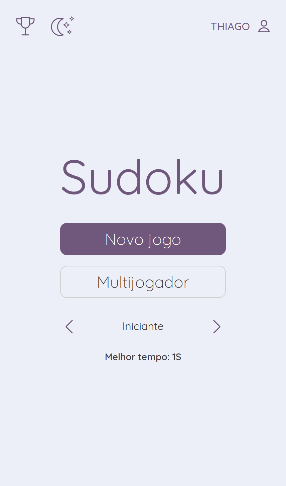
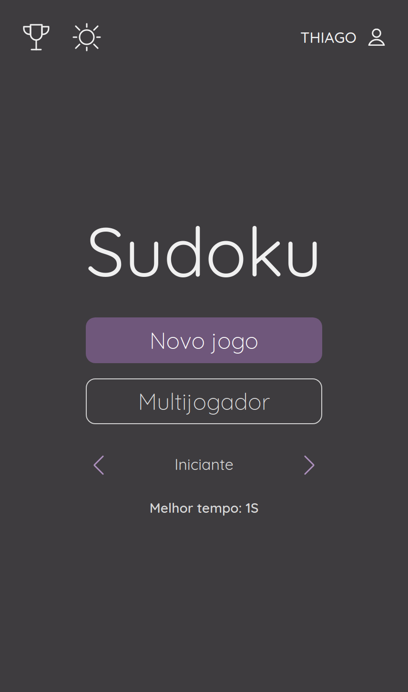
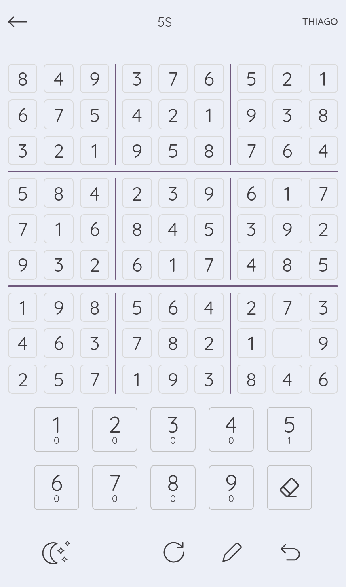
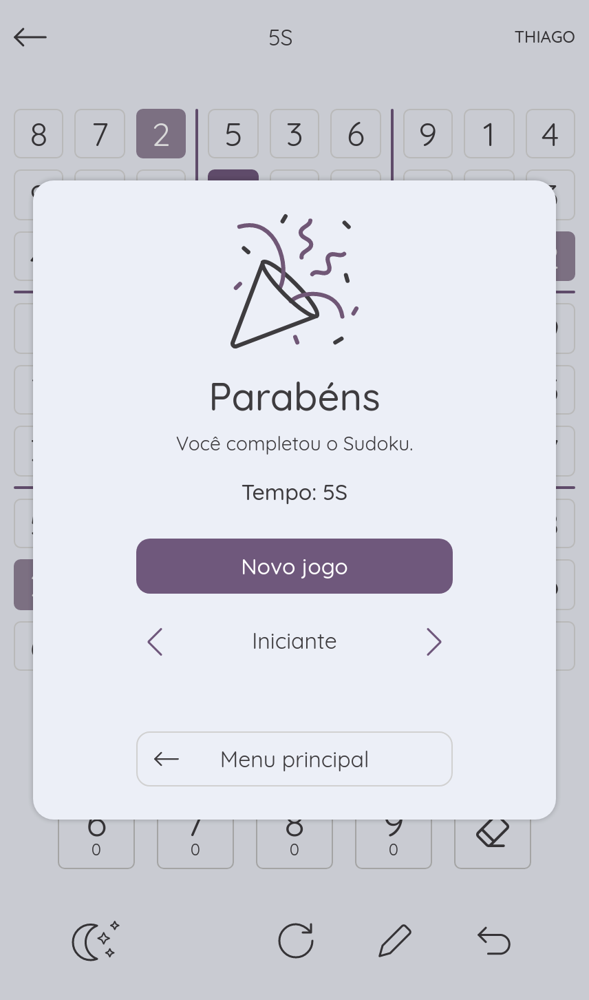
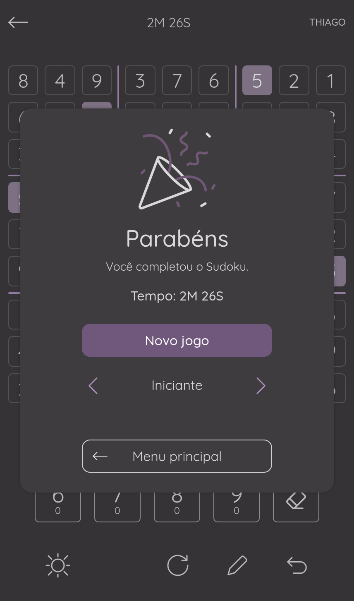
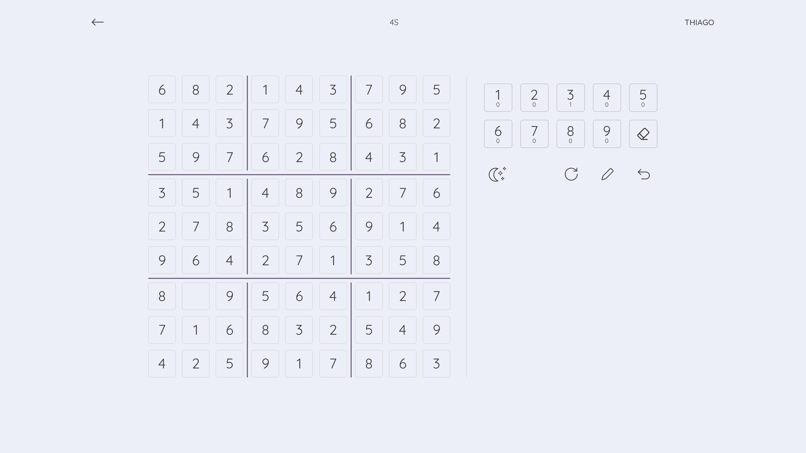
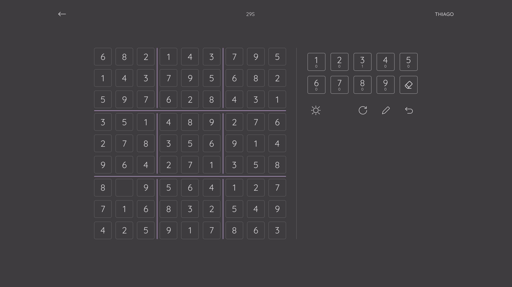

# Online Sudoku

### About this project

This project was made to learn Firebase and improve existent React and Typescript skills.
### Technologies

- Firebase
- Typescript
- ReactJS
  - Router dom
- Node SASS

## Preview
#### Acess application here
https://tbonlinesudoku.vercel.app/
#### Mobile

###

### 

#### Desktop

#### Made with ♥ by Thiago Buarque